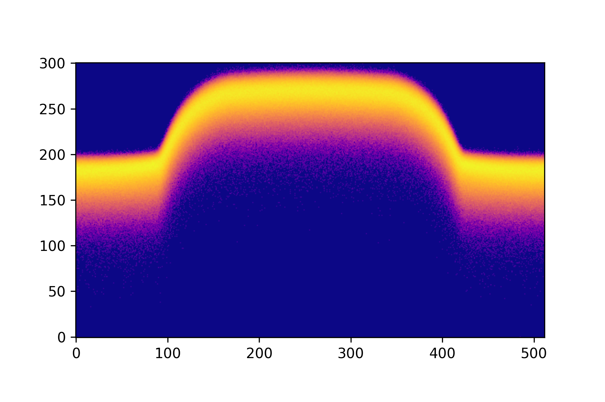
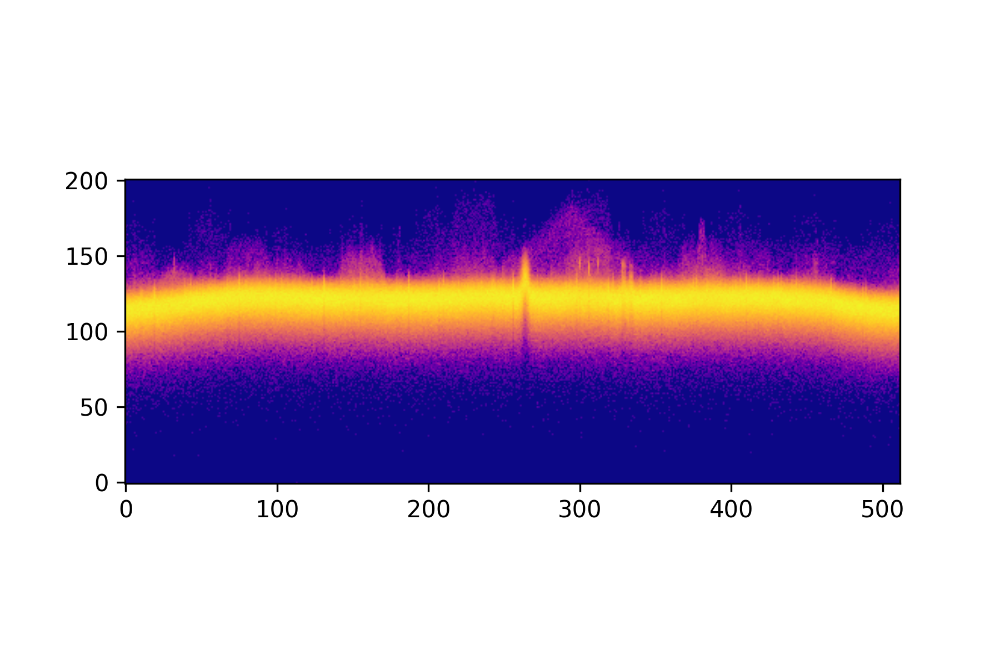
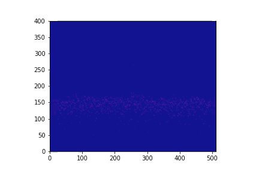

# Python-Intensity-Graded-FFT
Python function for creating intensity graded FFT plots and animations with numpy and matplotlib

There are Jupyter Notebooks that show how to use both the static plotting and animated methods using both generated data, in the form of a QPSK signal, and RTLSDR captures. 

The full description can be found on my blog post below.
[Tea and Tech Time: Python Intensity Graded FFT Plots]()

## Static Plot
QPSK Sample Plot

RTLSDR Sample Plot

## Animated Plot

